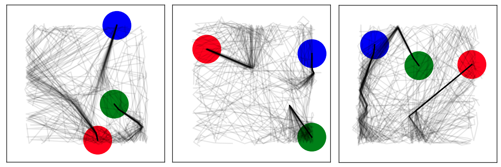

# Neural Probablistic Physics

Attempt to be sample efficient in learning intuitive physics by treating the environment
as a playground. Our uncertainty based approach learns 5x faster than vanilla SGD.

Here are a few results from the trained model.

<p float="left">
  
   
</p>

Our model is probablistic, here are examples of a few rollouts,

<p>
  
</p>


## Running

[Pre-Trained Model Zoo](https://www.dropbox.com/sh/bfxlaqa9uz88mg1/AADh_zUYml83lTLD3y0R4xnha?dl=0)

This repository has a recreation of [Chang et. al.'s neural physics engine](https://arxiv.org/abs/1612.00341), as well as our probablistic neural physics engine. The main driver file is
`npe_main.py`.

Generate and train as,

```
python npe_main.py --gen_data --dataset PATH_TO_DATASET
python npe_main.py --train --dataset PATH_TO_DATASET --model PATH_TO_MODEL
python npe_main.py --model_simulation --model PATH_TO_MODEL
```

Of course, one can also just show the actual chipmunk simulation,

```
python npe_main.py --show_world
```

### Cleaning

Just as a word of warning, this repo is still in the process of being cleaned.
